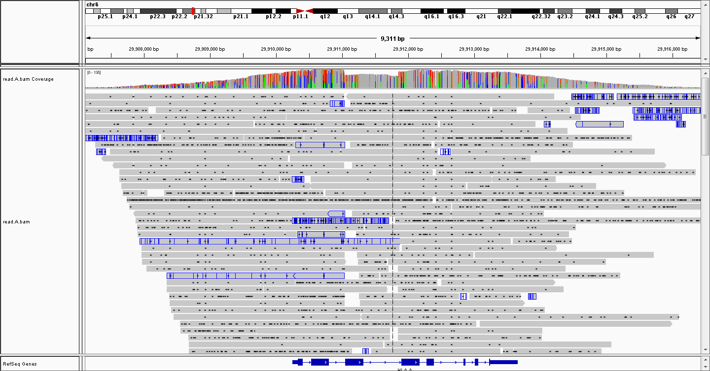
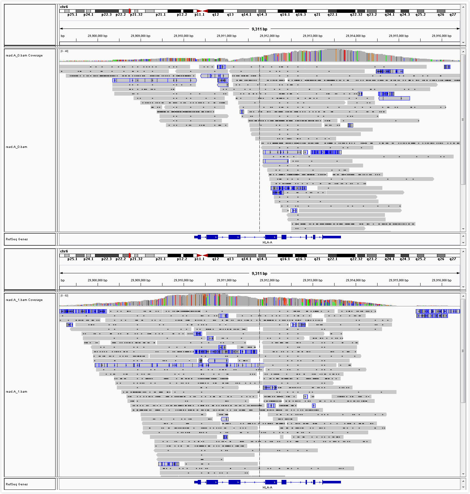
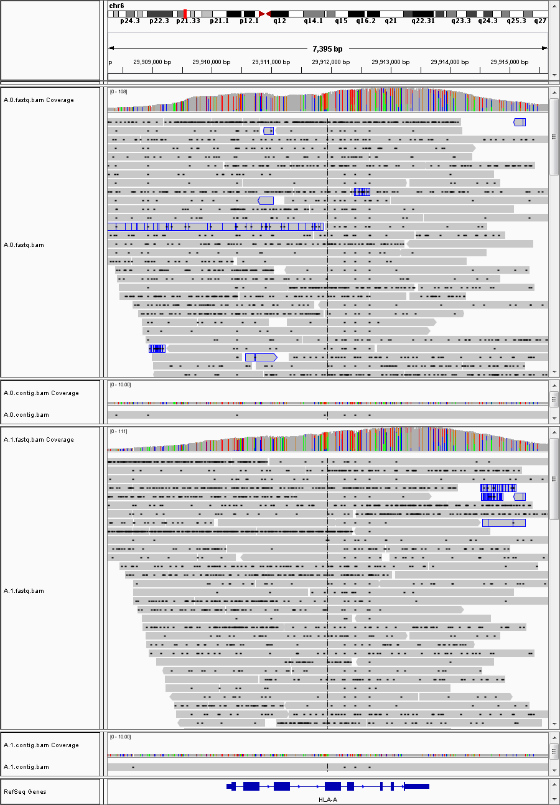

# PB_Phasing

- PacBio reads haplotype phasing program.

- Perform better than Samtools phase on PacBio extra long reads.

### All reads of gene HLA-A(IGV view).

### Samtools phasing result of gene HLA-A reads(IGV view).

### My phasing result of gene HLA-A reads(IGV view).

## Suggestions:
* If pattern frequency in seed selection is too low (2-3) and the pattern is too many (>40 SNPs) try to lower -w (500bp default) to 300.
* If read extention time is too low (<10) try to lower -c (0.95 default) to 0.8+.
